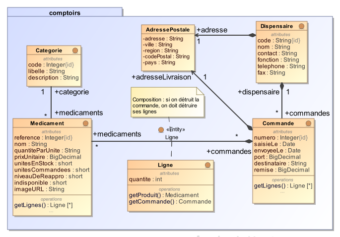
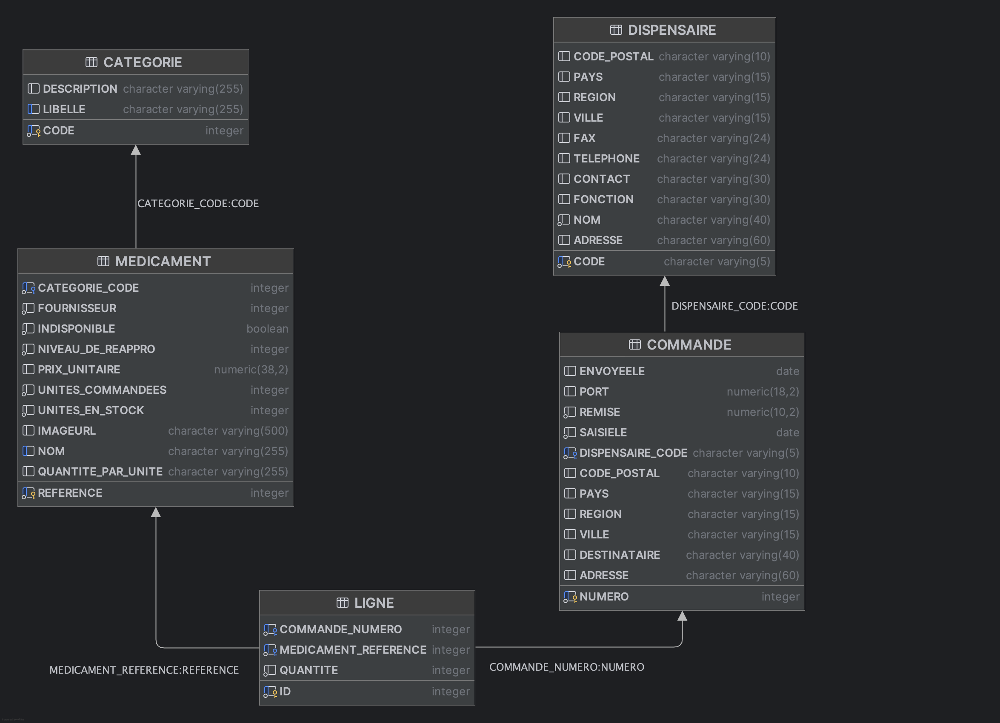

# Spring Boot Application - Gestion Pharmaceutique

## Description
Ce projet est une application Spring Boot destinée à une pharmacie centrale qui permet à des dispensaires de commander des médicaments. Le backend permet la gestion des médicaments et des commandes pour les dispensaires.

## Modèles de données

Le *modèle conceptuel de données* (UML/JPA) est le suivant :



Spring Data JPA va générer automatiquement le *modèle logique de données* (relationnel) suivant, conformément aux annotations des classes-entités :



## Enoncé du TP
A partir de ce point de départ :
- Complétez la mise en oeuvre du modèle conceptuel de données en rajoutant les entités nécessaires (paquetage [entity](src/main/java/pharmacie/entity/)). Rajoutez des contraintes d'intégrité pertinentes sur les propriétés des entités en utilisant les [annotations de validation JPA](https://www.baeldung.com/java-validation).
- Ajoutez les dépôts (Repository)  nécessaires (paquetage [dao](src/main/java/pharmacie/dao/)). Complétez les interfaces en ajoutant une méthode permettant de trouver toutes les commandes saisies après une date donnée, et une méthode permettant de trouver tous les dispensaires dans une région donnée, cf. [Extension des interfaces de dépôts](https://docs.spring.io/spring-data/jpa/reference/jpa/query-methods.html).
- Ajoutez des enregistrements dans chaque table en complétant le fichier [data.sql](src/main/resources/data.sql).
- Testez les méthodes de dépôts en complétant le fichier [RepositoryCustomMethodsTest.java](src/test/java/pharmacie/dao/RepositoryCustomMethodsTest.java).


## Structure du code fourni
### Couche "Accès aux données"
#### Entités
Les entités représentent les tables de base de données et leur mapping avec JPA.

- [Medicament](src/main/java/pharmacie/entity/Medicament.java): Représente les médicaments avec leurs informations (nom, prix, stock, image URL).
- [Categorie](src/main/java/pharmacie/entity/Categorie.java): Représente les catégories de médicaments.

#### Dépôts (Repositories)
Les dépôts gèrent l'accès aux entités via Spring Data JPA.

- [MedicamentRepository](src/main/java/pharmacie/dao/MedicamentRepository.java): Interface gérant les requêtes sur les entités `Medicament`.


## Technologies Utilisées
- **Java 21 LTS**
- **Spring Boot 3.5.3**
- **Spring Data JPA** avec Hibernate 6.6.18
- **Jakarta EE** (Jakarta Persistence API 3.1.0)
- **Lombok 1.18.42**
- **H2 Database 2.3.232** (développement)

## Démarrage de l'application

### Prérequis
- Java 21 LTS installé
- Maven 3.6+

### Lancer l'application
```bash
mvn clean spring-boot:run
```

L'application démarre sur le port **8080**  : [http://localhost:8080](http://localhost:8080)


### Données de test
L'application charge automatiquement des données de test au démarrage :
- **10 catégories** de médicaments (Antalgiques, Anti-inflammatoires, Antibiotiques, etc.) et quelques médicaments.

## Documentation
Consultez la documentation officielle pour mieux comprendre les technologies utilisées dans ce projet :

- **[Spring Boot 3.x Documentation](https://docs.spring.io/spring-boot/docs/current/reference/html/)**: Documentation complète de Spring Boot.
- **[Spring Data JPA](https://docs.spring.io/spring-data/jpa/reference/)**: Documentation sur l'intégration de JPA avec Spring.
- **[Jakarta Persistence](https://jakarta.ee/specifications/persistence/3.1/)**: Spécification Jakarta Persistence API 3.1.
- **[SpringDoc OpenAPI](https://springdoc.org/)**: Documentation pour SpringDoc OpenAPI.

## Guides Utiles
Voici des tutoriels pour démarrer avec les technologies Spring utilisées dans ce projet :

- **[Accessing Data with JPA](https://spring.io/guides/gs/accessing-data-jpa/)**: Accès aux données avec Spring Data JPA.
